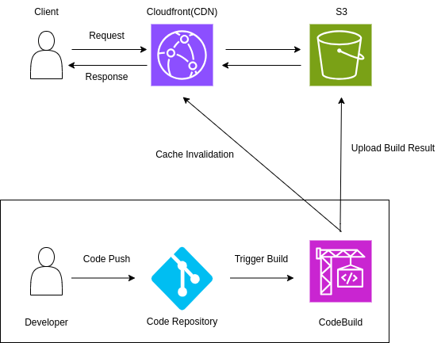

# Amazon PhotoQuery (Frontend)

## 프로젝트 개요

Amazon PhotoQuery는 클라우드 기반 사진 앨범 서비스로, 사용자가 저장된 사진을 쉽게 검색하고 관리할 수 있도록 돕는 모바일 앱입니다. 웹 플랫폼에서 동작하며, AI 기반의 검색 기능을 제공합니다.
k

## 주요 기능

- **앨범**: 앨범을 이용해 사용자의 사진을 저장하고 관리할 수 있는 기능
  - 데모 영상
    - 
- **자연어 검색**: 사용자가 자연어로 검색 쿼리를 입력하면 쿼리와 유사도와 높은 사진을 결과로 반환합니다.
  - 데모 영상
    - 
  - https://github.com/hjk1996/aws-app-rekognition-image-analysis
  - https://github.com/hjk1996/aws-app-image-caption

- **얼굴 검색**: 업로드한 사진에서 인물의 얼굴을 인식하여 앨범 속에서 해당 인물이 등장하는 사진들을 찾습니다.
  - 데모 영상
    - 
  -  https://github.com/hjk1996/aws-app-rekognition-image-analysis

- **태그 기반 사진 조회**: 앨범 속 사진들을 자동으로 태그에 따라 분류하고 조회할 수 있습니다.상
  - 데모 영상
    - 

## 기술 스택

- 프론트엔드
  - Flutter
- 배포
  - CodeBuild
  - S3
  - CloudFront
## 배포 방식

1. **코드 푸시**

   - 개발자는 새로운 변경 사항을 GitHub 리포지토리에 푸시합니다.

2. **자동 빌드**
   - 푸시 이벤트는 AWS CodeBuild를 트리거하며, 이는 코드 변경 사항을 자동으로 빌드합니다.
3. **S3 업로드 및 배포**
   - 빌드가 성공적으로 완료되면, 빌드 결과물은 Amazon S3 버킷에 업로드됩니다.
   - S3 버킷에 업로드된 빌드 결과물은Amazon CloudFront를 통해 전 세계에 배포됩니다.

4. **캐시 무효화**
   - S3에 새로운 빌드 결과물을 업로드하는 동시에, CloudFront의 캐시 무효화 과정이 자동으로 시작됩니다.
   - 이는 최신 버전의 웹사이트가 사용자에게 즉각적으로 제공되도록 합니다.
